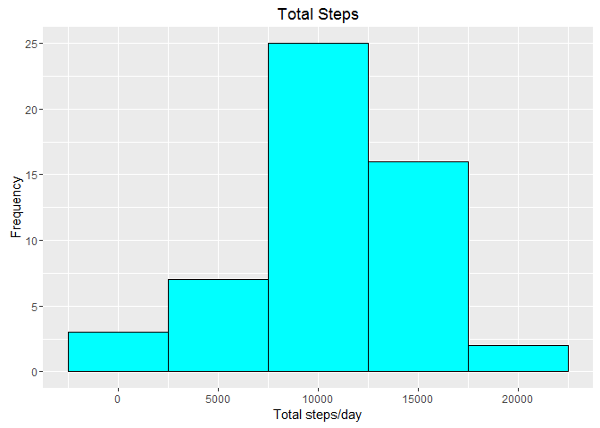
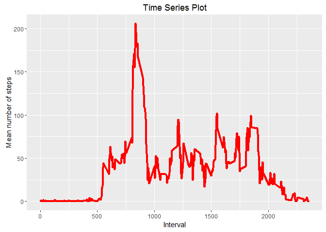
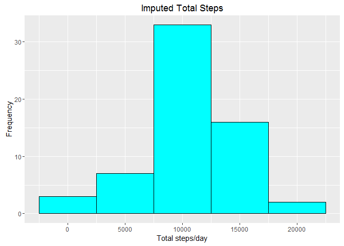
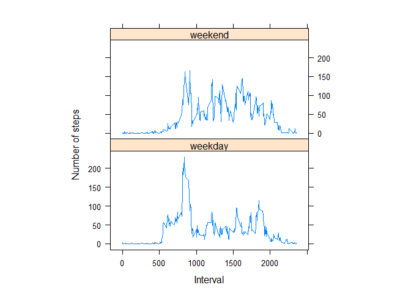

# Reproducible Research - Peer Assessment 1
Balakrishna Padmanabhan  
May 15, 2016  


## Introduction

It is now possible to collect a large amount of data about personal movement using activity monitoring devices such as a Fitbit, Nike Fuelband, or Jawbone Up. These type of devices are part of the "quantified self" movement - a group of enthusiasts who take measurements about themselves regularly to improve their health, to find patterns in their behavior, or because they are tech geeks. But these data remain under-utilized both because the raw data are hard to obtain and there is a lack of statistical methods and software for processing and interpreting the data.
 


## Loading and Processing the data

Data is collected from a personal activity monitoring device. This device collects data at 5 minute intervals through out the day. The data consists of two months of data from an anonymous individual collected during the months of October and November, 2012 and include the number of steps taken in 5 minute intervals each day.

The data is stored in the file **activity.csv**, which stored in the current working directory.  The variables included in this dataset are:

* **steps**: Number of steps taking in a 5-minute interval (missing values are coded as NA)
* **date**: The date on which the measurement was taken in YYYY-MM-DD format
* **interval**: Identifier for the 5-minute interval in which measurement was taken

The dataset is stored in a comma-separated-value (CSV) file and there are a total of 17,568 observations in this dataset.


```r
setwd("~/Documents/Coursera/ReproducibleResearch")
activityData <- read.csv("activity.csv")
```

Convert the data to an appropriate format.


```r
activityData$date <- as.Date(activityData$date,"%Y-%m-%d")
str(activityData)
```

```
## 'data.frame':	17568 obs. of  3 variables:
##  $ steps   : int  NA NA NA NA NA NA NA NA NA NA ...
##  $ date    : Date, format: "2012-10-01" "2012-10-01" ...
##  $ interval: int  0 5 10 15 20 25 30 35 40 45 ...
```
## What is the mean total number of steps taken per day?
* Calculate the total number of steps taken per day.

```r
totSteps<-aggregate(steps~date,data=activityData,sum,na.rm=TRUE)
```
* Plot a histogram of the total number of steps

```r
library(ggplot2)
g<-ggplot(totSteps,aes(x=steps))
g+geom_histogram(binwidth=5000,fill="cyan",col="black")+labs(y="Frequency")+labs(x="Total steps/day")+labs(title="Total Steps")
```

<!-- -->

* Calculate the mean and median of the total number of steps taken per day

```r
summary(totSteps$steps)
```

```
##    Min. 1st Qu.  Median    Mean 3rd Qu.    Max. 
##      41    8841   10760   10770   13290   21190
```
## What is the average daily activity pattern?
* Time series plot

```r
stepsInterval <- aggregate(steps ~ interval, data = activityData, mean, na.rm = TRUE)
g<-ggplot(stepsInterval,aes(x=interval,y=steps))
g + geom_line(color="red",size=1.5) + labs(title="Time Series Plot") + labs(y="Mean number of steps") + labs(x="Interval")
```

<!-- -->
* Which 5-minute interval, on average across all the days in the dataset, contains the maximum number of steps?

```r
maxStep <-stepsInterval[which.max(stepsInterval$steps),"interval"]
```
The interval 835 contains the maximum number of steps.
## Imputing missing values
* Calculate and report the total number of missing values in the dataset (i.e. the total number of rows with NAs)

```r
sum(is.na(activityData$steps))
```

```
## [1] 2304
```
* Devise a strategy for filling in all of the missing values in the dataset. The strategy does not need to be sophisticated. For example, you could use the mean/median for that day, or the mean for that 5-minute interval, etc.

Use the appropriate mean steps calculated earlier for replacing the missing values.

* Create a new dataset that is equal to the original dataset but with the missing data filled in.

```r
newSet<-activityData
for(i in 1:nrow(newSet)) {
  if(is.na(newSet$steps[i])){
    index<- newSet$interval[i]
     value <- subset(stepsInterval,interval==index)
     newSet$steps[i]<-value$steps
  }
}
```
* Create a new dataset that is equal to the original dataset but with the missing data filled in.


```r
newtotSteps<-aggregate(steps~date,data=newSet,sum,na.rm=TRUE)
g<-ggplot(newtotSteps,aes(x=steps))
g+geom_histogram(binwidth=5000,fill="cyan",col="black")+labs(y="Frequency")+labs(x="Total steps/day")+labs(title="Imputed Total Steps")
```

<!-- -->
Comparing the two histograms, we can see that imputing the data with mean values, increased the frequency counts for the 7500-12500 range.

## Are there differences in activity patterns between weekdays and weekends?
* Create a new factor variable in the dataset with two levels - "weekday" and "weekend" indicating whether a given date is a weekday or weekend day.


```r
newSet$day <- ifelse(weekdays(newSet$date) %in% c("Saturday", "Sunday"), "weekend", "weekday")
newSet$day <- factor(newSet$day,levels=c("weekday","weekend"))
newInterval <- aggregate(steps~interval + day,newSet,mean)
library(lattice)
xyplot(steps~interval|factor(day), data=newInterval,aspect=1/2,type="l",ylab="Number of steps",xlab="Interval")
```

<!-- -->

Both plots show no or very little activity in the first 500 intervals.  The activity during the weekend, however, is spread more during the weekends than the weekdays.  During the weekdays, the activity peaks from the 500-1000 intervals and  afterwhich the number steps remains below 100 steps.
 
